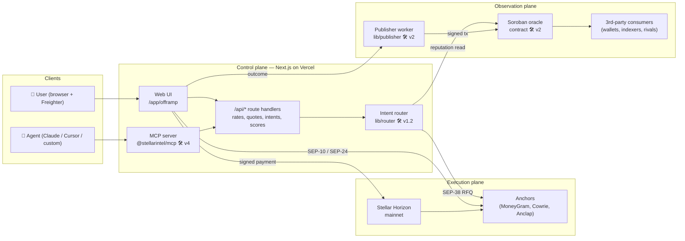
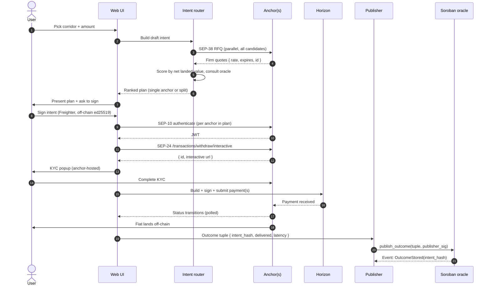
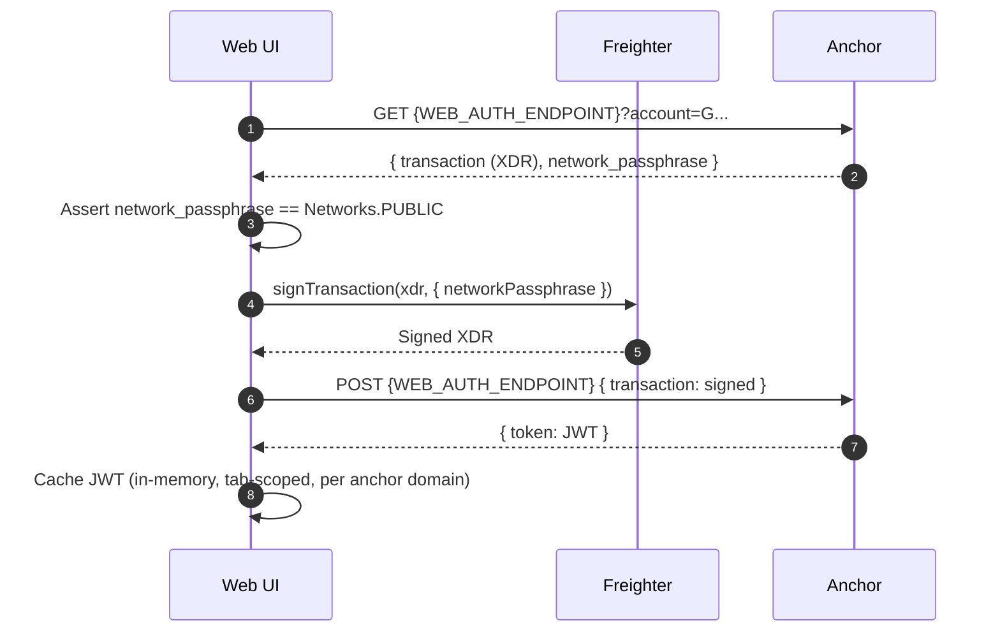
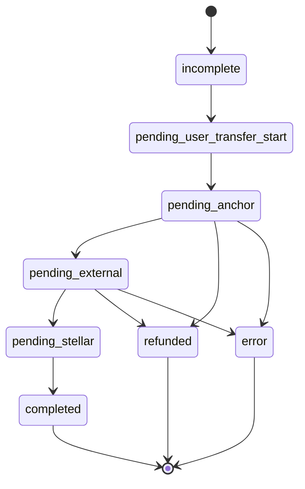
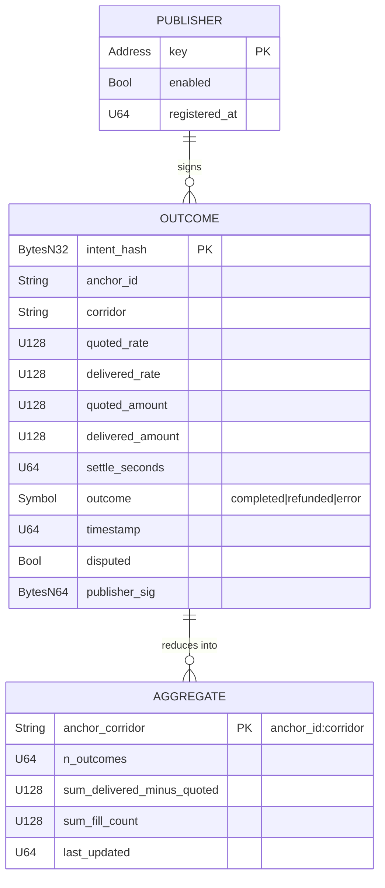

# Stellar Intel — Architecture

> How the pieces fit together. This document is the map a new contributor
> reads before opening a PR, the reviewer consults before approving one, and
> the grant committee reads to understand what is actually being built.
>
> Scope: the intent router, the reputation write path, the Soroban oracle,
> the MCP/agent surface, and the SEP-10/24/38 flow. Where something ships
> today it is marked ✅; where it is planned it is marked 🛠️ and the
> milestone wave is named.

---

## Table of contents

1. [System overview](#1-system-overview)
2. [Component inventory & repo layout](#2-component-inventory--repo-layout)
3. [The intent lifecycle](#3-the-intent-lifecycle)
4. [SEP-10 / SEP-24 / SEP-38 — the anchor handshake](#4-sep-10--sep-24--sep-38--the-anchor-handshake)
5. [Intent router internals](#5-intent-router-internals)
6. [Reputation write path](#6-reputation-write-path)
7. [Soroban oracle](#7-soroban-oracle)
8. [MCP / agent surface](#8-mcp--agent-surface)
9. [Trust boundaries & invariants](#9-trust-boundaries--invariants)
10. [File map](#10-file-map)

---

## 1. System overview

Stellar Intel is three planes sharing one vocabulary (the intent):

- **Control plane** — the Next.js app (web UI + API routes) and the MCP server.
  Both consume the same router and oracle primitives.
- **Execution plane** — the anchors (MoneyGram, Cowrie, Anclap today) reached
  over SEP-10/24/38, and the Stellar ledger itself for payment submission.
- **Observation plane** — the Soroban reputation oracle on mainnet, fed by a
  publisher worker; read permissionlessly by any third party.



The user's wallet is the only thing that holds keys. The app holds none; the
router holds none; the publisher holds one key, used only to submit reputation
writes to Soroban — never to move user funds.

---

## 2. Component inventory & repo layout

| Module | Role | Path | Status |
| --- | --- | --- | --- |
| **Offramp page** | The end-user surface. Corridor select → rate table → execute drawer → status tracker. | `app/offramp/page.tsx` | ✅ |
| **RateTable** | Sortable list of live anchor quotes for the selected corridor. | `components/offramp/RateTable.tsx` | ✅ |
| **ExecuteDrawer** | 6-step SEP-10/24 off-ramp: `authenticating → initiating → kyc → building → signing → done`. | `components/offramp/ExecuteDrawer.tsx` | ✅ |
| **StatusTracker** | Polls `/transaction?id=...` and renders the SEP-24 state machine. | `components/offramp/StatusTracker.tsx` | ✅ |
| **Anchor registry** | Typed list of anchors + corridors + assets. Single source of truth. | `lib/stellar/anchors.ts` | ✅ |
| **SEP-1 resolver** | `stellar.toml` discovery, TRANSFER_SERVER_SEP0024 + WEB_AUTH_ENDPOINT extraction. | `lib/stellar/sep1.ts` | ✅ |
| **SEP-10 client** | Challenge fetch, Freighter sign, JWT exchange. Network asserted as mainnet. | `lib/stellar/sep10.ts` | ✅ |
| **SEP-24 client** | `/fee`, `/transactions/withdraw/interactive`, `/transaction` wrappers. 10s timeout. | `lib/stellar/sep24.ts` | ✅ |
| **Horizon helper** | Build + sign + submit the user's withdrawal payment on the Stellar ledger. | `lib/stellar/horizon.ts` | ✅ |
| **Freighter hook** | Wallet connection state + account + network. | `hooks/useFreighter.ts` | ✅ |
| **Rates hook** | SWR-powered parallel rate aggregation across all anchors on a corridor. | `hooks/useAnchorRates.ts` | ✅ |
| **Status hook** | SWR polling loop keyed by `[transferServer, transactionId, jwt]`. | `hooks/useWithdrawStatus.ts` | ✅ |
| **SEP-38 client** | Firm-quote RFQ against anchors; supersedes the `/fee` + stored-rate approach. | `lib/stellar/sep38.ts` | 🛠️ v1.1 |
| **Intent canonicalizer** | Deterministic JSON → hash → sign. | `lib/intent/canonical.ts` | 🛠️ v1.2 |
| **Intent router (solver)** | Scores candidate anchors by net landed value; returns a single-anchor or split plan. | `lib/router/` | 🛠️ v1.2 |
| **Publisher worker** | Signs outcome tuples and invokes the Soroban contract. | `lib/publisher/` | 🛠️ v2 |
| **Soroban oracle contract** | On-chain reputation storage + read helpers. | `contracts/oracle/` | 🛠️ v2 |
| **MCP server** | Exposes router + oracle as MCP tools. | `packages/mcp/` | 🛠️ v4 |
| **SDK** | Typed client for the API + MCP. | `packages/sdk/` | 🛠️ v4 |

> All module paths are namespaced — no runtime concern spans two modules in
> opposite directions. `lib/stellar/*` has no dependencies on `lib/router/*`
> or `lib/publisher/*`; `components/*` only imports from `lib/*` and `hooks/*`.

---

## 3. The intent lifecycle

An **intent** is the user's signed, canonicalized statement of purpose. It is
the atomic unit every other component is built around.

```ts
// types/intent.ts — planned shape
interface Intent {
  version: 1
  nonce: string                 // 128-bit random, replay protection
  account: string               // user's Stellar public key
  corridor: `${string}-${string}` // e.g. 'usdc-ngn'
  sellAsset: { code: string; issuer: string }
  sellAmount: string            // decimal string
  buyAsset: { code: string }    // fiat, e.g. 'NGN'
  minReceive: string            // floor on delivered amount
  deliveryHint: DeliveryHint    // bank / mobile-money / cash pickup
  deadline: string              // RFC3339
  preferences?: {
    allowSplit: boolean         // default: true
    maxAnchors: number          // default: 2
    preferAnchorIds?: string[]  // user whitelist
  }
}
interface SignedIntent {
  intent: Intent
  intentHash: string            // sha-256 over canonical JSON
  signature: string             // ed25519 over intentHash, by account
}
```

Canonicalization rules live in `docs/CANONICAL_JSON.md` (sorted keys, no
trailing whitespace, fixed UTF-8 encoding, integer normalization). The hash is
what everyone commits to: the user when they sign, the anchor when they
honour a quote, the publisher when they write the outcome.

### Lifecycle



Steps 1–11 are implemented today (single-anchor path, without SEP-38 — see
§ 4). Steps 12–16 land with the reputation wave (v2).

---

## 4. SEP-10 / SEP-24 / SEP-38 — the anchor handshake

### 4.1 SEP-1 — discovery ✅

`getTransferServer(domain)` and `getWebAuthEndpoint(domain)` fetch and cache
the anchor's `stellar.toml`, pulling `TRANSFER_SERVER_SEP0024` and
`WEB_AUTH_ENDPOINT`. Everything downstream is keyed off those two URLs.

### 4.2 SEP-10 — authentication ✅



Implemented in `lib/stellar/sep10.ts`. Key invariants:

- **Network pinning.** `fetchChallenge` throws if the anchor's
  `network_passphrase` is not mainnet. This blocks a malicious anchor from
  trying to phish a testnet-scoped signature into a mainnet replay.
- **JWT is scoped.** The JWT is used only as the `Authorization: Bearer …`
  header on that anchor's SEP-24 endpoints. It is never passed cross-anchor.
- **Ephemeral.** No JWT is persisted to localStorage or IndexedDB.

### 4.3 SEP-24 — interactive withdrawal ✅

`ExecuteDrawer` walks six steps, each with an error state and a cancel path:

| Step | Substrate | What happens | Failure recovery |
| --- | --- | --- | --- |
| `authenticating` | SEP-10 | Fetch challenge, sign, exchange for JWT. | Retry in-place; on rejection, return to idle. |
| `initiating` | SEP-24 | `POST /transactions/withdraw/interactive` with JWT. | Surface anchor error; retry with fresh JWT. |
| `kyc` | Anchor-hosted iframe | Open the returned URL in a popup. Anchor owns the KYC surface. | On popup close without success, poll `/transaction` for `pending_user`. |
| `building` | Horizon | `buildWithdrawPayment` — construct the USDC payment to the anchor's receiving address at the quoted amount. | Fee estimation retries; network reselect. |
| `signing` | Freighter | User signs the payment XDR. | User-reject returns to idle; signature-required errors surface. |
| `done` | — | Drawer closes; `onSuccess` hoists `{ transactionId, transferServer, jwt }` to the page; `StatusTracker` mounts. | Terminal. |

**The `done` hoist is the fix for credibility bug #2** (see `PROPOSAL.md § 5`).
Before `commit 45a82eb` the drawer completed the withdrawal but never told the
page; after, the drawer closes on success and the tracker owns the viewport
with a live `transactionId`.

### 4.4 SEP-24 status machine ✅

The polling loop in `hooks/useWithdrawStatus.ts` fans these SEP-24 values into
five UI states (`types/index.ts:105–119` is the authoritative enum):



Terminal states (`completed`, `refunded`, `error`) stop the SWR poll. Non-
terminal states poll on a 5-second cadence with exponential backoff on
consecutive failures (hardening lands with v1.1).

### 4.5 SEP-38 — firm quote RFQ 🛠️ v1.1

Today's rate aggregation uses SEP-24 `/fee` + a cached exchange rate, which is
correct enough for comparison but not firm. v1.1 replaces this with SEP-38:

```
POST /sep38/quote
{ sell_asset, sell_amount, buy_asset, context: "sep24" }
→ { id, price, expires_at, total_price, fee }
```

The returned `id` is then passed as `quote_id` to `POST /transactions/withdraw/interactive`
so the anchor is contractually bound to the price. This is the moment the
product moves from "useful rate page" to "firm execution layer" — and it is
also what makes every future reputation write comparable (we have a stated
quote to compare the delivered amount against).

---

## 5. Intent router internals 🛠️ v1.2

The router takes a draft intent and returns a **plan**: one or more anchors,
each with a quoted amount, ranked so that the top result maximizes expected
net landed value.

### Scoring

For each candidate anchor `a` on the intent's corridor, and each amount chunk
`n` the router considers:

```
score(a, n) = grossRate(a, n)            // SEP-38 firm rate
            − feeFrac(a, n)              // anchor fee as fraction of sell
            − slippagePenalty(a, n)      // historical quote → delivered delta
            − failurePenalty(a)          // 1 − fillRate(a)
            × settlementDiscount(a)      // 1 / (1 + latency_hours × λ)
```

The `slippagePenalty`, `failurePenalty`, and `settlementDiscount` inputs are
all read from the reputation oracle — **not** from the anchor's self-report.
That inversion is the whole point: the anchor cannot score itself.

### Splitting

For intents above a threshold (configurable per corridor, default $5,000 USDC),
the router considers splitting across up to `maxAnchors` anchors. Split is
**only** proposed when:

1. At least two anchors have quoted the corridor in the last 30 seconds.
2. The sum of their chunks' `score` is strictly greater than the best single
   anchor's score, net of the fixed-fee cost of the second leg.
3. Both anchors have a `fillRate` above a floor (default 0.9).

If any of the three fails, the router returns a single-anchor plan. We never
propose a split to look sophisticated — splits exist when they are strictly
better.

### Determinism

The router is deterministic given the same inputs and the same oracle snapshot
root. A plan is replayable from its inputs, which matters for dispute
resolution.

---

## 6. Reputation write path 🛠️ v2

Every terminal intent (completed, refunded, or error) produces an **outcome
tuple** the publisher writes to the Soroban oracle.

```mermaid
sequenceDiagram
  autonumber
  participant UI as Web UI
  participant API as /api/outcomes
  participant Q as Outcome queue
  participant P as Publisher worker
  participant O as Soroban oracle

  UI->>API: POST outcome { intent_hash, anchor_id, delivered_rate, delivered_amount, settle_seconds, outcome, stellar_tx }
  API->>API: Verify user-signed intent_hash exists; verify stellar_tx on-chain
  API->>Q: Enqueue
  Q->>P: Lease next outcome
  P->>P: Canonicalize tuple; sign with publisher key
  P->>O: invoke publish_outcome(tuple, sig)
  O-->>P: Emits OutcomeStored(intent_hash, anchor_id, corridor)
  P->>Q: Ack (on OutcomeStored receipt)
  alt Transient error
    P->>Q: Nack with backoff
  else Fatal error (verified forgery)
    P->>Q: Dead-letter + Sentry alert
  end
```

### Properties

- **User-witnessed, not anchor-claimed.** The outcome's `delivered_amount`
  comes from the SEP-24 `/transaction` response *and* (where possible) a
  ledger lookup of the `stellar_transaction_id`. The user's wallet signs the
  trigger. An anchor cannot inflate its own delivery numbers.
- **Publisher cannot invent.** The publisher key signs transport, not
  content. The on-chain contract verifies that the `intent_hash` references a
  known intent and that the `stellar_tx` exists on the public ledger.
- **At-least-once delivery.** The queue is durable; Soroban writes are
  idempotent keyed on `intent_hash`. A duplicate write returns the stored
  event, not a new one.
- **Dead-letter on dispute.** If the anchor disputes an outcome inside the
  dispute window, it is routed to human review; the write proceeds with a
  `disputed: true` flag.

---

## 7. Soroban oracle 🛠️ v2

The oracle is a single Soroban contract (`contracts/oracle/`) with a small,
upgrade-gated surface.

### Storage



### Interface

```rust
// contracts/oracle/src/lib.rs — planned surface
pub trait Oracle {
    fn publish_outcome(env: Env, tuple: Outcome, sig: BytesN<64>) -> Result<(), Error>;
    fn read_outcome(env: Env, intent_hash: BytesN<32>) -> Option<Outcome>;
    fn read_aggregate(env: Env, anchor_id: Symbol, corridor: Symbol) -> Aggregate;
    fn dispute(env: Env, intent_hash: BytesN<32>, reason: Symbol) -> Result<(), Error>;
    fn add_publisher(env: Env, new_key: Address) -> Result<(), Error>;       // admin
    fn remove_publisher(env: Env, old_key: Address) -> Result<(), Error>;    // admin
}
```

### Upgrade policy

- **Admin** — a 2-of-3 multisig held by the maintainer and two community
  signers (onboarded pre-v2 release). The admin can enable/disable publishers;
  it cannot rewrite outcomes.
- **Upgradability** — the contract is upgradable via a Soroban
  `UpdateCurrentContract` operation, gated by the admin multisig, with a
  mandatory 7-day on-chain time-lock on every upgrade proposal.
- **Publisher whitelist** — starts at one (Stellar Intel's publisher). Over
  time, third-party publishers onboard; governance lives in
  `docs/ORACLE_SPEC.md`.

### Consumer ergonomics

Two client libraries ship alongside the contract:

- `contracts/oracle/sdk-rs/` — Rust consumer for other Soroban contracts
  (`read_aggregate` helper, typed structs).
- `packages/sdk/oracle.ts` — TypeScript consumer for off-chain readers
  (wallets, rival aggregators, dashboards).

---

## 8. MCP / agent surface 🛠️ v4

The MCP server (`packages/mcp/`) is a thin adapter: its tools are 1:1 with the
HTTP API, typed with the same schemas. An agent can discover, quote, execute,
and read reputation — with zero held keys.

### Tools

| Tool | Input | Output | Authority |
| --- | --- | --- | --- |
| `list_corridors` | — | `Corridor[]` | Read-only. |
| `list_anchors_for_corridor` | `{ corridorId }` | `Anchor[]` | Read-only. |
| `quote_corridor` | `{ corridorId, sellAmount, deliveryHint? }` | `Plan` | Read-only; RFQs live anchors. |
| `build_intent` | `{ plan, deadlineSeconds, preferences? }` | `Intent` (unsigned) | Read-only. |
| `submit_signed_intent` | `{ intent, signature }` | `{ transactionIds[] }` | Executes — requires user signature from the calling wallet. |
| `read_reputation` | `{ anchorId, corridorId }` | `Aggregate` | Read-only. |
| `read_outcome` | `{ intentHash }` | `Outcome \| null` | Read-only. |
| `watch_transaction` | `{ transactionId, transferServer, jwt }` | Event stream | Read-only. |

### Agent-safety invariants

1. **No signing in the MCP.** `submit_signed_intent` *requires* a signature
   produced by the end-user's wallet. The server never holds a key capable of
   moving funds.
2. **Scoped JWTs.** The MCP never caches an anchor JWT longer than a single
   intent's lifetime.
3. **Auditable.** Every `submit_signed_intent` call logs `intent_hash +
   signature + caller` to an append-only local log for the user to review.
4. **Rate-limited.** Per-caller and per-account quote caps prevent an agent
   from hammering anchors during a runaway loop.

Install: `claude mcp add stellar-intel npx -y @stellarintel/mcp@latest`.
See `docs/MCP.md` for the end-to-end tutorial and three worked examples.

---

## 9. Trust boundaries & invariants

A reviewer should leave this document certain of the following seven
invariants. If any is broken by a PR, the PR is wrong.

1. **We never hold user keys.** Signing happens in Freighter (web) or the
   caller's wallet (agent). No key material is ever transmitted to our
   servers.
2. **We never hold user funds.** Payment flows directly from the user's
   Stellar account to the anchor's receiving address. No Stellar Intel
   account sits between them.
3. **We never touch fiat.** Fiat settlement is between the anchor and the
   user's bank / mobile-money provider. Stellar Intel has no banking rail.
4. **Network is pinned.** Every SEP-10 challenge must be mainnet-scoped or it
   is rejected at parse time.
5. **Outcomes are user-witnessed.** Every reputation write references a
   user-signed `intent_hash` and an on-ledger `stellar_transaction_id`. An
   anchor cannot backfill its own reputation.
6. **The publisher cannot invent.** The publisher signs transport, not
   content. The contract verifies shape and on-ledger existence.
7. **Data is permissionless to read.** The oracle has no read-access
   control. Aggregates are free for anyone to consume.

Threats against these invariants — anchor failure, replay, MITM, publisher
key compromise, agent misuse — are enumerated in `docs/THREAT_MODEL.md`.

---

## 10. File map

```
stellar-intel/
├── app/
│   ├── offramp/page.tsx           # ✅ end-user surface
│   ├── layout.tsx
│   └── page.tsx
├── components/offramp/
│   ├── RateTable.tsx              # ✅ live quote table
│   ├── ExecuteDrawer.tsx          # ✅ 6-step SEP-10/24 flow
│   ├── StatusTracker.tsx          # ✅ SEP-24 state machine UI
│   ├── CountrySelector.tsx        # ✅
│   └── CurrencySelector.tsx       # ✅
├── hooks/
│   ├── useAnchorRates.ts          # ✅ SWR rate aggregation
│   ├── useFreighter.ts            # ✅ wallet connection
│   ├── useWithdrawStatus.ts       # ✅ SEP-24 polling
│   └── useTheme.ts                # ✅
├── lib/
│   ├── config.ts                  # ✅ env-guarded config
│   ├── utils.ts                   # ✅ computeTotalReceived, format helpers
│   └── stellar/
│       ├── anchors.ts             # ✅ registry (MoneyGram, Cowrie, Anclap)
│       ├── sep1.ts                # ✅ stellar.toml resolver
│       ├── sep10.ts               # ✅ challenge → sign → JWT
│       ├── sep24.ts               # ✅ /fee, /interactive, /transaction
│       ├── sep38.ts               # 🛠️ v1.1 firm-quote RFQ
│       └── horizon.ts             # ✅ build + submit payment
├── lib/intent/                    # 🛠️ v1.2 canonicalizer, hash, sign
├── lib/router/                    # 🛠️ v1.2 solver
├── lib/publisher/                 # 🛠️ v2 outcome publisher
├── contracts/oracle/              # 🛠️ v2 Soroban oracle
├── packages/
│   ├── mcp/                       # 🛠️ v4 MCP server
│   └── sdk/                       # 🛠️ v4 typed client
├── types/index.ts                 # ✅ Anchor, Corridor, AnchorRate, WithdrawStatus, …
├── tests/                         # ✅ vitest — anchors, SEP-1, SEP-10, status
├── docs/
│   ├── PROPOSAL.md                # grant thesis
│   ├── ARCHITECTURE.md            # this document
│   ├── ROADMAP.md                 # wave-by-wave scope
│   ├── INTENT_API.md              # intent schema + signing
│   ├── ORACLE_SPEC.md             # Soroban interface
│   ├── MCP.md                     # agent surface
│   ├── ANCHOR_REPUTATION.md       # scoring methodology
│   ├── CANONICAL_JSON.md          # hash canonicalization
│   ├── THREAT_MODEL.md            # adversaries + mitigations
│   ├── NON_CUSTODY.md             # custody manifesto
│   ├── JURISDICTIONAL.md          # money-transmission memo
│   └── SECURITY.md                # disclosure policy
└── .github/workflows/             # ✅ ci, codeql, lighthouse, data-health, …
```

Paths marked ✅ are present on `main` today; paths marked 🛠️ land with the
wave noted. Anything else is a documentation gap — open an issue with the
`docs` label.

---

_See also: [`docs/PROPOSAL.md`](PROPOSAL.md) for the thesis,
[`docs/ROADMAP.md`](ROADMAP.md) for the wave plan, and
[`docs/THREAT_MODEL.md`](THREAT_MODEL.md) for adversarial analysis._
